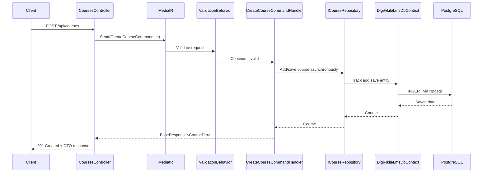

# DigiFikile LMS Backend — Intern Onboarding and Development Guide

> Read this document before changing backend code. It explains where code belongs, how a request moves through the system, and how to replace scaffolded stubs without breaking Clean Architecture.

## 1. Welcome: what this repository is

This directory contains the backend for **DigiFikile LMS**, a Learning Management System API built with **.NET 9**.

The solution is organized using:

- **Clean Architecture** to separate business rules from frameworks and technical details.
- **CQRS** with **MediatR** to separate write operations from read operations.
- **FluentValidation** to validate incoming command and query data.
- **AutoMapper** to convert domain entities into API-safe DTOs.
- **Entity Framework Core** for database access.
- **Npgsql** as the EF Core provider for PostgreSQL.
- **ASP.NET Core controllers and middleware** for the HTTP API.

The solution file is:

```text
DigiFikileLms.sln
```

### Important: this is a scaffold

This repository provides the structure and contracts for the API, but many operations are intentionally unfinished.

- Controllers are connected to MediatR.
- Commands and queries exist for the main LMS areas.
- Entities, interfaces, DTOs, mappings, validators, repositories, and services are scaffolded.
- Many handlers and infrastructure implementations currently throw `NotImplementedException`.
- Some validators and entity rules contain `TODO` comments.

Therefore:

> A project that builds successfully is not necessarily a feature-complete project.

Do not assume an endpoint works because it appears in Swagger. Follow its command or query to the handler and check every dependency used by that handler.

## Submitted Implementation Status

This section records the work currently submitted and verified in the repository.

### Detailed reports

- **`docs/2026-09-16-fixes-and-errors-report.md`** — every fix and error from the two-step OTP login,
  the SETA Administrator provisioning flow, the new Complaints entity and the removal of the generic
  Admin surface. Includes literal error messages, root causes, fixes, prevention notes, the applied
  migration and a full file inventory.
- `docs/otp-and-seta-admin-provisioning.md` — endpoint contracts for the two-step login and the
  provisioning flow, plus the OTP / e-mail handover checklist.
- `docs/2026-09-11-incident-and-fix-report.md` — Supabase "unhealthy" status and the shadow
  foreign-key startup crash.
- `docs/authentication-authorization.md` — the endpoint authorization matrix.

### Environment and database

- The API targets .NET 9 and is organized into Domain, Application, Infrastructure, and API projects.
- PostgreSQL is configured through the existing Supabase connection pooler.
- Pooling remains enabled with `Maximum Pool Size=100` and `SearchPath=lms`.
- The local `.env` file contains the working connection string and is ignored by git.
- `.env.example` documents the required connection-string format without credentials.
- Runtime startup loads `.env`; the EF Core design-time factory loads it as well.
- API startup applies EF Core migrations with `Database.MigrateAsync()`.
- Seed-data execution was removed from API startup.

### Verified API behavior

The following endpoints were tested successfully against the configured database:

| Method | Endpoint | Result |
|---|---|---|
| POST | `/api/Auth/student/register` | Creates a `UserAccount` and `Student` record |
| POST | `/api/Auth/student/login` | Verifies student number and password |
| POST | `/api/Auth/admin/login` | Admin credential flow is implemented; requires an administrator account |
| GET | `/swagger/index.html` | Swagger UI returns HTTP 200 |

The student registration test created a student account and the matching login test returned HTTP 200. Authentication responses currently return an empty token because JWT implementation is intentionally deferred.

### Architecture implemented for this slice

- API controllers bind HTTP requests and send MediatR commands.
- Application handlers coordinate registration and login through repository and password-hasher interfaces.
- Domain owns `UserAccount`, `Student`, and `UserRole` concepts.
- Infrastructure persists users and students through EF Core repositories.
- Student-number uniqueness and email uniqueness are checked before registration.
- Passwords are passed through the existing `IPasswordHasher` abstraction; JWT generation is not part of this submission.

### Known remaining work

- JWT authentication and authorization are intentionally deferred.
- Many LMS handlers remain scaffolded or contain `NotImplementedException` placeholders.
- Several endpoints are currently anonymous for development testing and need authorization policies once JWT is introduced.
- The ERD contains more concepts than the currently verified vertical slice; additional relationships, DTOs, handlers, controllers, and migrations must be implemented incrementally.
- Existing warnings remain for the AutoMapper package vulnerability (NU1903). The EF Core `Submission.StudentId1` shadow foreign key was resolved by pairing the Submission→Student relationship and migration `FixSubmissionStudentRelationship`.

### Local verification commands

```powershell
dotnet build DigiFikileLms.API\DigiFikileLms.API.csproj
dotnet run --project DigiFikileLms.API\DigiFikileLms.API.csproj --launch-profile http
```

Open Swagger at `http://localhost:5000/swagger` after starting the API.

## 2. What you will learn here

After reading this guide, you should be able to:

1. Explain the purpose of Domain, Application, Infrastructure, and API.
2. Apply the Clean Architecture dependency rule.
3. Decide which project should contain a new piece of code.
4. Follow an HTTP request from a controller to PostgreSQL and back.
5. distinguish a CQRS Command from a Query.
6. Implement a new use case without putting business logic in a controller.
7. Replace an existing `NotImplementedException` safely.
8. Create and apply EF Core migrations.
9. run PostgreSQL and the API locally.
10. Validate, build, and manually test changes before opening a pull request.

## 3. Mental model: Clean Architecture in plain English

Imagine the application as a set of rings.

- The **inside** describes the LMS itself: users, courses, lessons, enrollments, assessments, and their rules.
- The **middle** describes actions the LMS can perform: create a course, enroll a learner, or read progress.
- The **outside** contains replaceable technical details: PostgreSQL, EF Core, JWT creation, ASP.NET Core, Swagger, and HTTP.

The inside must not know how the outside works.

For example, a `Course` should know that it begins as a draft. It should not know:

- which PostgreSQL table stores it;
- which URL creates it;
- how JSON is formatted;
- how Swagger documents it;
- which HTTP status code is returned.

This separation matters because business rules usually outlive technical tools. PostgreSQL could be replaced, the API could add another delivery mechanism, or a new authentication provider could be introduced without rewriting the core LMS model.

### The four questions to ask before adding code

| Question | If the answer is yes, the code usually belongs in |
|---|---|
| Is this a business concept or invariant that remains true without a web server or database? | `DigiFikileLms.Domain` |
| Is this a use case that coordinates business objects and abstractions? | `DigiFikileLms.Application` |
| Is this an EF Core, PostgreSQL, JWT, hashing, or external service detail? | `DigiFikileLms.Infrastructure` |
| Is this about HTTP routes, status codes, request binding, middleware, or host startup? | `DigiFikileLms.API` |

### A concrete example

Requirement: “An instructor creates a draft course.”

| Concern | Correct layer |
|---|---|
| A new course has `Draft` status | Domain |
| `CreateCourseCommand` describes the use case input | Application |
| The handler checks dependencies and coordinates creation | Application |
| `ICourseRepository` defines persistence operations without EF details | Domain |
| `CourseRepository` stores the entity through EF Core | Infrastructure |
| The EF configuration maps `Course` to PostgreSQL | Infrastructure |
| `POST /api/courses` accepts the HTTP request | API |
| The controller returns the appropriate HTTP response | API |

## 4. The dependency rule: arrows point inward

The central rule of this solution is:

> Source-code dependencies must point toward the Domain.

```text
                         OUTSIDE / TECHNICAL DETAILS

      +-------------------- DigiFikileLms.API ---------------------+
      | Controllers, middleware, Program.cs, HTTP, Swagger         |
      |                           |                                 |
      |                           v                                 |
      |    +---------- DigiFikileLms.Infrastructure -----------+    |
      |    | EF Core, PostgreSQL, repositories, JWT, services  |    |
      |    |                       |                            |    |
      |    |                       v                            |    |
      |    |      +------ DigiFikileLms.Application ------+    |    |
      |    |      | Use cases, CQRS, DTOs, validation     |    |    |
      |    |      |                 |                     |    |    |
      |    |      |                 v                     |    |    |
      |    |      |   +-- DigiFikileLms.Domain -------+   |    |    |
      |    |      |   | Entities, rules, interfaces   |   |    |    |
      |    |      |   +-------------------------------+   |    |    |
      |    |      +---------------------------------------+    |    |
      |    +-------------------------------------------------+    |
      +-----------------------------------------------------------+

                             ARROWS POINT INWARD
```

A compact representation is:

```text
Domain <- Application <- Infrastructure
                     ^
                     |
                    API
```

The API is the **composition root**. It is allowed to register Application and Infrastructure services. That does not give inner projects permission to reference the API.

### Allowed and forbidden references

| Project | May depend on | Must not depend on |
|---|---|---|
| Domain | .NET base libraries | Application, Infrastructure, API, EF Core, ASP.NET Core, MediatR |
| Application | Domain and application-oriented libraries such as MediatR, FluentValidation, AutoMapper | Infrastructure, API, concrete EF `DbContext`, ASP.NET Core HTTP types |
| Infrastructure | Domain and Application | API controllers or HTTP response logic |
| API | Application and Infrastructure | Business rules or direct database implementation logic |

### Dependency inversion in practice

Application needs token generation, but it must not know the JWT library. It defines or consumes `ITokenService`; Infrastructure implements `TokenService`; API startup registers the implementation.

```text
Application handler -> ITokenService <- Infrastructure TokenService
                               ^
                               |
                   registered by dependency injection
```

This pattern lets Application depend on an abstraction pointing inward while Infrastructure supplies the replaceable detail.

## 5. Solution map: where everything belongs

```text
DigiFikile-LMS.Backend/
|-- DigiFikileLms.Domain/
|   |-- Common/
|   |-- Entities/
|   |-- Enums/
|   `-- Interfaces/
|-- DigiFikileLms.Application/
|   |-- Common/
|   |-- DTOs/
|   |-- Features/
|   |   |-- Auth/
|   |   |-- Users/
|   |   |-- Roles/
|   |   |-- Courses/
|   |   |-- Content/
|   |   |-- Enrollments/
|   |   |-- Assessments/
|   |   |-- Progress/
|   |   `-- Reports/
|   |-- Interfaces/
|   |-- Mappings/
|   `-- Validators/
|-- DigiFikileLms.Infrastructure/
|   |-- Extensions/
|   |-- Persistence/
|   |   |-- Configurations/
|   |   |-- Context/
|   |   `-- Repositories/
|   `-- Services/
|-- DigiFikileLms.API/
|   |-- Controllers/
|   |-- Extensions/
|   |-- Middleware/
|   `-- Program.cs
|-- docker-compose.yml
`-- DigiFikileLms.sln
```

### 5.1 `DigiFikileLms.Domain`

**Purpose:** represent stable LMS concepts and business rules without depending on frameworks.

| Folder | What belongs here | Examples |
|---|---|---|
| `Entities/` | Business objects with identity, state, and behavior | `Course`, `Module`, `Lesson`, `Enrollment`, `Assessment` |
| `Enums/` | Closed sets of meaningful domain values | course or assessment status/type values |
| `Interfaces/` | Persistence-agnostic repository contracts | `ICourseRepository`, `IUserRepository` |
| `Common/` | Shared domain building blocks | base entities, auditing contracts, domain events |

Domain code should:

- use business language;
- protect valid state with private setters;
- use methods such as `Create(...)`, `Publish()`, or other meaningful actions;
- contain invariants that must remain true regardless of UI or storage;
- expose persistence contracts without mentioning EF Core.

Domain code must not contain:

- `DbContext`, `DbSet`, `Include`, or EF queries;
- controllers, routes, or HTTP status codes;
- MediatR commands or DTOs;
- JWT, configuration, logging, or database connection strings.

### 5.2 `DigiFikileLms.Application`

**Purpose:** describe and coordinate the actions the LMS can perform.

| Folder | What belongs here |
|---|---|
| `Features/` | CQRS commands, queries, and handlers grouped by business area |
| `DTOs/` | Data shapes safe to return to callers |
| `Validators/` | FluentValidation rules for request shape, length, range, and format |
| `Mappings/` | AutoMapper profiles that map entities to DTOs |
| `Common/` | Shared response, pagination, validation, and application exception types |
| `Interfaces/` | Technical capability contracts needed by use cases, such as token, password, current-user, and database abstractions |

Feature areas currently scaffolded under `Features/` are:

```text
Auth
Users
Roles
Courses
Content
Enrollments
Assessments
Progress
Reports
```

`Content` contains use cases used by the `ModulesController` and `LessonsController`.

Application handlers may:

- load entities through interfaces;
- coordinate multiple domain objects;
- call domain behavior;
- save through interfaces;
- map results to DTOs;
- return `BaseResponse<T>`;
- pass `CancellationToken` through every asynchronous operation.

Application handlers must not:

- use `HttpContext`, `IActionResult`, controllers, or HTTP status codes;
- call concrete EF Core classes;
- build SQL;
- implement JWT or password hashing algorithms;
- return tracked entities to the API.

### 5.3 `DigiFikileLms.Infrastructure`

**Purpose:** implement replaceable technical details required by inner layers.

| Folder | What belongs here |
|---|---|
| `Persistence/Context/` | `DigiFikileLmsDbContext`, design-time factory, database initialization |
| `Persistence/Configurations/` | EF Core table, key, relationship, index, conversion, and constraint mappings |
| `Persistence/Repositories/` | Concrete implementations of Domain repository interfaces |
| `Services/` | JWT, password hashing, current-user, or other technical service implementations |
| `Extensions/` | Dependency injection, authentication, and database startup registration |

Infrastructure may know about:

- EF Core;
- Npgsql and PostgreSQL;
- connection strings;
- JWT libraries;
- ASP.NET Core integration needed by concrete outer services.

Infrastructure must not decide business policy. A repository stores and retrieves state; it should not decide whether a course may be published.

### 5.4 `DigiFikileLms.API`

**Purpose:** expose Application use cases over HTTP and configure the running process.

| Location | Responsibility |
|---|---|
| `Controllers/` | Bind HTTP input, dispatch one command/query, translate outcomes to HTTP |
| `Middleware/` | Handle exceptions, correlation IDs, and request logging across all endpoints |
| `Extensions/` | Register API services, Swagger, CORS, auth, and middleware pipeline |
| `Program.cs` | Compose the application and start the host |

Controllers currently exist for:

- `AuthController`
- `UsersController`
- `RolesController`
- `CoursesController`
- `ModulesController`
- `LessonsController`
- `EnrollmentsController`
- `AssessmentsController`
- `ProgressController`
- `ReportsController`

Do not add a controller simply because a feature has a folder. First check whether an existing controller owns the HTTP resource.

Controllers should be thin enough to understand at a glance:

```text
bind input -> send one MediatR request -> choose HTTP response
```

## 6. Domain glossary

| Term | Meaning in DigiFikile LMS | Typical relationship |
|---|---|---|
| **User** | A platform account, such as an administrator, instructor, or learner. | A user can have roles, teach courses, enroll in courses, and make attempts. |
| **Role** | A named grouping of access rights. | A role has permissions and can be assigned to users. |
| **Permission** | A fine-grained authorization capability. | Permissions are grouped into roles. |
| **Course** | A top-level learning offering created by an instructor. | A course contains modules, enrollments, and assessments. |
| **Module** | An ordered section within a course. | A module belongs to one course and contains lessons. |
| **Lesson** | An individual unit of learning content. | A lesson belongs to a module and can have learner progress. |
| **Enrollment** | The relationship recording that a learner is registered for a course. | It connects a user to a course. |
| **Assessment** | A graded learning activity such as a quiz, assignment, or exam. | It belongs to a course and contains questions. |
| **Question** | A prompt within an assessment. | It belongs to an assessment and contributes to scoring. |
| **AssessmentAttempt** | A learner's submission or attempt for an assessment. | It connects a learner to an assessment and records outcomes. |
| **ProgressRecord** | A learner's recorded completion state for learning content. | It connects learner progress to a lesson/course context. |

Use these terms consistently. Do not introduce synonyms such as `Class` for `Course` or `Chapter` for `Module` unless the domain model is intentionally being changed.

## 7. How a request flows end to end

Use the existing course creation route as the mental model:

```text
POST /api/courses
```

The intended completed flow is:

```text
HTTP client
    |
    | POST /api/courses with JSON
    v
CoursesController.Create
    |
    | mediator.Send(CreateCourseCommand, cancellationToken)
    v
MediatR pipeline
    |
    v
ValidationBehavior
    |
    | runs CreateCourseCommandValidator
    | invalid -> validation exception -> exception middleware -> HTTP error
    | valid   -> continue
    v
CreateCourseCommandHandler
    |
    | checks required related state through interfaces
    | calls Course.Create(...)
    v
ICourseRepository
    |
    v
CourseRepository
    |
    v
DigiFikileLmsDbContext
    |
    | EF Core + Npgsql
    v
PostgreSQL
    |
    | saved Course
    v
AutoMapper -> CourseDto
    |
    v
BaseResponse<CourseDto>
    |
    v
CoursesController -> HTTP 201 Created
```

Equivalent Mermaid diagram:



### Current scaffold caveat

The intended flow above is not fully implemented yet:

- `CreateCourseCommandHandler` currently throws `NotImplementedException`.
- Validator rules are still marked `TODO`.
- Repository methods may still be stubbed.
- The current `CoursesController.Create` action returns `Ok(...)`, which is HTTP 200. When the create use case is completed, the API layer should deliberately translate successful creation to HTTP 201, without putting that HTTP decision in Application or Domain.

This distinction is important: documentation of the desired architecture is not proof that the current stub executes it.

## 8. CQRS explained simply

CQRS means **Command Query Responsibility Segregation**.

In plain English:

- A **Command** asks the system to change something.
- A **Query** asks the system to return information without changing business state.

| Type | Purpose | Naming | Repo examples |
|---|---|---|---|
| Command | Create, update, publish, enroll, submit, record | Verb + subject + `Command` | `CreateCourseCommand`, `UpdateCourseCommand`, `PublishCourseCommand` |
| Query | Read, search, list, report | Question/read intent + `Query` | `GetAllCoursesQuery`, `GetCourseByIdQuery` |

### Command example

```text
CreateCourseCommand
Title
Description
InstructorId
```

The command contains only the data needed to request the write. Its handler performs the use case.

### Query example

```text
GetCourseByIdQuery
Id
```

Its handler reads data and returns a DTO response without intentionally changing domain state.

### Why handlers exist

MediatR finds the matching handler at runtime:

```text
CreateCourseCommand
        |
        v
CreateCourseCommandHandler
```

The controller does not construct the handler or repository. Dependency injection does that.

### Where validation runs

`ValidationBehavior<TRequest, TResponse>` is registered as a MediatR pipeline behavior. For each request it:

1. discovers matching FluentValidation validators;
2. executes them asynchronously;
3. combines failures;
4. throws the application validation exception when invalid;
5. calls the handler only when validation passes.

Do not manually call validators from every controller.

### Command/query DO and DON'T

**DO**

- Keep request records immutable and focused.
- Give each handler one use-case responsibility.
- Put format and boundary validation in FluentValidation.
- Put permanent business invariants in Domain behavior.
- Forward the cancellation token.

**DON'T**

- Perform work inside a command/query record.
- update the database from a query.
- use a command for a read-only operation.
- inject controllers or `HttpContext` into handlers.
- create one giant handler for unrelated actions.

## 9. Coding rules and practices for interns

### 9.1 SOLID in this repository

| Principle | Practical meaning here |
|---|---|
| Single Responsibility | A controller adapts HTTP; a handler runs one use case; a repository persists; an entity protects business state. |
| Open/Closed | Add focused behavior or implementations without repeatedly rewriting unrelated core code. |
| Liskov Substitution | Implementations must honor their interfaces; replacing a repository implementation must not change its promised behavior unexpectedly. |
| Interface Segregation | Prefer focused contracts over one enormous service or repository interface. |
| Dependency Inversion | Application and Domain depend on abstractions; Infrastructure supplies concrete implementations. |

SOLID is guidance for clear boundaries, not a reason to create an interface for every tiny class.

### 9.2 Protect entity state

Prefer:

```csharp
public string Title { get; private set; } = string.Empty;
public static Course Create(string title, string description, Guid instructorId) { ... }
```

Avoid:

```csharp
public string Title { get; set; }
```

Public setters allow any caller to bypass rules. Private setters plus factory and behavior methods make valid changes explicit.

### 9.3 Use factory `Create` methods

A factory such as `Course.Create(...)` creates a valid domain object in one place. Put invariants there when they depend only on supplied values and domain state.

Do not pass an EF `DbContext` into an entity factory to check the database. A handler should load related state through an interface, then call Domain behavior with the trusted result.

### 9.4 Return `BaseResponse<T>` consistently

Application use cases use `BaseResponse<T>` to represent:

- success with `Data`;
- expected failure with `Errors`;
- validation failure information.

Use its factory methods:

```text
BaseResponse<T>.Success(data)
BaseResponse<T>.Failure(errors)
BaseResponse<T>.ValidationFailure(errors)
```

Do not set its private properties by reflection or introduce a different response wrapper for one feature without an architectural reason.

The API still owns HTTP translation. `BaseResponse<T>` is not an HTTP response and should not contain `StatusCode`.

### 9.5 Never put EF Core in Domain

**DO**

- Configure entities in `Infrastructure/Persistence/Configurations`.
- Query in Infrastructure repository implementations.
- Keep repository interfaces free of EF types.

**DON'T**

- add EF attributes to Domain entities for convenience;
- return `IQueryable<T>` from Domain contracts;
- use `DbSet`, `Include`, or `EntityTypeBuilder` in Domain.

### 9.6 Never put business logic in controllers

Controllers may bind, authorize, dispatch, and translate. They must not decide core rules.

Bad:

```text
Controller loads course -> checks publish rules -> changes entity -> calls DbContext
```

Good:

```text
Controller sends PublishCourseCommand -> handler coordinates -> domain enforces publish rule
```

### 9.7 Use async and `CancellationToken`

All I/O should be asynchronous. Pass the token from controller to MediatR, from handler to repository, and from repository to EF Core.

```text
Controller ct -> mediator.Send(..., ct)
Handler ct    -> repository.GetByIdAsync(..., ct)
Repository ct -> dbContext.SaveChangesAsync(ct)
```

Never use `.Result`, `.Wait()`, or omit the token because “the call is small.”

### 9.8 Return DTOs, not entities

Entities may contain:

- navigation properties;
- internal state;
- data clients should not see;
- cyclic object graphs;
- persistence tracking behavior.

Map them to DTOs before returning them. Add or update mappings in `Application/Mappings`.

### 9.9 Additional safety rules

**DO**

- follow neighboring names and namespaces;
- keep secrets out of commits;
- use parameterized EF operations;
- produce clear validation messages;
- check authorization at the appropriate boundary;
- make the smallest coherent change;
- build after changing contracts.

**DON'T**

- catch and ignore exceptions;
- log passwords, JWTs, or connection strings;
- return stack traces to API clients;
- silently change an interface without updating all implementations and consumers;
- mix refactoring unrelated to the assigned feature into the same PR;
- remove a `NotImplementedException` and return fake success data.

## 10. Prerequisites and quick start

### 10.1 Install prerequisites

- [.NET 9 SDK](https://dotnet.microsoft.com/download)
- [Docker Desktop](https://www.docker.com/products/docker-desktop/)
- An IDE such as Cursor, Visual Studio, or VS Code
- Optional but useful: EF Core CLI tool

Verify installations:

```bash
dotnet --version
docker --version
docker compose version
```

The .NET version should be a compatible `9.x` SDK.

Install or update EF Core CLI if `dotnet ef` is unavailable:

```bash
dotnet tool install --global dotnet-ef
```

or:

```bash
dotnet tool update --global dotnet-ef
```

### 10.2 Restore and build

From `DigiFikile-LMS.Backend`:

```bash
dotnet restore DigiFikileLms.sln
dotnet build DigiFikileLms.sln
```

Fix build errors before creating migrations or debugging endpoints.

### 10.3 Start PostgreSQL

From `DigiFikile-LMS.Backend`:

```bash
docker compose up -d
docker compose ps
```

Local Docker values:

| Setting | Value |
|---|---|
| Container | `digifikile-lms-postgres` |
| Database | `digifikile_lms_dev` |
| Username | `digifikile` |
| Password | `digifikile` |
| Host from local machine | `localhost` |
| Port | `5432` |

These are development credentials only.

### 10.4 Check the connection string

`DigiFikileLms.API/appsettings.json` uses:

```json
"ConnectionStrings": {
  "DigiFikileLmsDb": "Host=localhost;Port=5432;Database=digifikile_lms_dev;Username=digifikile;Password=digifikile"
}
```

The key must be exactly:

```text
DigiFikileLmsDb
```

### 10.5 Create a migration when one does not exist

Run from `DigiFikile-LMS.Backend`:

```bash
dotnet ef migrations add InitialCreate \
  --project DigiFikileLms.Infrastructure \
  --startup-project DigiFikileLms.API
```

On PowerShell, place the command on one line or use PowerShell's backtick continuation character instead of `\`.

Do not create another `InitialCreate` if migrations already exist. Use a descriptive name such as `AddCourseIndexes` or `AddLessonDuration`.

### 10.6 Apply migrations

```bash
dotnet ef database update \
  --project DigiFikileLms.Infrastructure \
  --startup-project DigiFikileLms.API
```

In Development, `Program.cs` also calls database initialization at startup, which applies pending migrations. Explicitly running `database update` is still useful because migration failures are easier to isolate.

### 10.7 Run the API

```bash
dotnet run --project DigiFikileLms.API
```

The launch profiles currently use:

- `https://localhost:7001`
- `http://localhost:5000`

Swagger UI is configured at the application root in Development and Staging:

```text
https://localhost:7001/
```

The exact listening URLs printed by `dotnet run` are authoritative. A health endpoint is mapped at:

```text
/health
```

### 10.8 Stop the local database

```bash
docker compose down
```

This preserves the named PostgreSQL volume. To avoid accidental data loss, do not remove the volume unless you intentionally need a fresh database.

## 11. Configuration reference

Primary local configuration is in:

```text
DigiFikileLms.API/appsettings.json
```

### 11.1 `ConnectionStrings`

| Key | Purpose |
|---|---|
| `ConnectionStrings:DigiFikileLmsDb` | PostgreSQL connection used by `DigiFikileLmsDbContext` |

Environment-variable form:

```text
ConnectionStrings__DigiFikileLmsDb
```

### 11.2 `Jwt`

| Key | Purpose |
|---|---|
| `Jwt:Issuer` | Identifies the token issuer |
| `Jwt:Audience` | Identifies intended token recipients |
| `Jwt:SecretKey` | Secret used to sign tokens |

Environment-variable forms:

```text
Jwt__Issuer
Jwt__Audience
Jwt__SecretKey
```

Never commit a production secret. The checked-in secret value is a replacement marker, not a production credential. Use environment variables or the team's approved secret store.

### 11.3 `Cors`

| Key | Purpose |
|---|---|
| `Cors:AllowedOrigins` | Browser origins permitted by the named CORS policy |

The local value is currently an empty array. Add only explicit trusted origins required for the environment. Do not use a wildcard with credentials.

Environment variables can represent array entries:

```text
Cors__AllowedOrigins__0=https://example-client
Cors__AllowedOrigins__1=https://another-client
```

### Configuration DO and DON'T

**DO**

- use environment-specific values;
- keep development settings safe for local use;
- restart the API after changing environment variables;
- verify the exact configuration key spelling.

**DON'T**

- commit real secrets;
- hard-code connection strings inside repositories;
- read configuration directly from Domain entities;
- log sensitive configuration.

## 12. How to add a new feature: full checklist

The word “feature” here means a complete use case, not only a controller action.

### Step 1: understand and write the behavior

Before coding, identify:

1. Who may perform the action?
2. What input is required?
3. What makes the input malformed?
4. What business rules must remain true?
5. What data must be read or changed?
6. What should the caller receive?
7. Is this a Command or Query?
8. Does the database schema change?

Do not begin with a migration or controller until these questions are clear.

### Step 2: Domain

Only make Domain changes when the business model requires them.

- [ ] Add or update an entity in `Domain/Entities`.
- [ ] Add an enum in `Domain/Enums` if the values are a stable closed set.
- [ ] protect mutable state with private setters.
- [ ] Add a factory or behavior method for invariant-protected changes.
- [ ] Add/update a focused repository contract in `Domain/Interfaces` if persistence capability is needed.
- [ ] Keep the contract asynchronous and include `CancellationToken`.
- [ ] Do not reference EF Core, MediatR, HTTP, or DTOs.

### Step 3: Application

- [ ] Put the use case under the correct `Application/Features/{Area}` folder.
- [ ] Create a `Command` for a write or a `Query` for a read.
- [ ] Define the expected `BaseResponse<T>` result.
- [ ] Create a focused MediatR handler.
- [ ] Inject interfaces, never concrete Infrastructure implementations.
- [ ] Add FluentValidation rules for input shape and format.
- [ ] Enforce database-dependent checks in the handler.
- [ ] Enforce permanent entity invariants in Domain methods.
- [ ] Add/update the response DTO in `Application/DTOs`.
- [ ] Add/update AutoMapper configuration in `Application/Mappings`.
- [ ] pass `CancellationToken` to every asynchronous dependency.
- [ ] Return real data or a meaningful failure; never fake success.

### Step 4: Infrastructure

- [ ] Implement any new/changed repository method in `Persistence/Repositories`.
- [ ] Use async EF Core methods.
- [ ] Pass `CancellationToken`.
- [ ] Add/update EF configuration for tables, keys, relationships, indexes, lengths, and conversions.
- [ ] Implement technical services in `Services` when needed.
- [ ] Register implementations in `Infrastructure/Extensions`.
- [ ] Keep business decisions out of repositories and EF configurations.

### Step 5: API

- [ ] Use the existing controller if it owns the resource.
- [ ] Add the action under `DigiFikileLms.API/Controllers`.
- [ ] Bind route, body, and query values explicitly.
- [ ] Construct/send exactly one command or query through `IMediator`.
- [ ] Pass the action `CancellationToken`.
- [ ] Translate success/failure to the correct HTTP status.
- [ ] Return DTO response shapes, not entities.
- [ ] Add authorization metadata when required by the use case.
- [ ] Do not query `DbContext` or repositories from the controller.

Use only existing controller resource names unless the API design intentionally adds a new resource:

```text
Auth, Users, Roles, Courses, Modules, Lessons,
Enrollments, Assessments, Progress, Reports
```

### Step 6: Migration, if the model changed

Build first:

```bash
dotnet build DigiFikileLms.sln
```

Create a descriptive migration:

```bash
dotnet ef migrations add DescriptiveMigrationName \
  --project DigiFikileLms.Infrastructure \
  --startup-project DigiFikileLms.API
```

Then:

1. Read the generated migration.
2. Check that it changes only what you intended.
3. Pay special attention to dropped columns/tables and nullable changes.
4. Apply it locally.
5. Start the API and exercise the use case.

### Step 7: verify the complete path

- [ ] Valid request succeeds.
- [ ] Invalid request is rejected before the handler.
- [ ] Missing related data produces a controlled failure.
- [ ] Unauthorized access is rejected where applicable.
- [ ] Data is actually persisted or read.
- [ ] The response contains a DTO.
- [ ] Cancellation tokens are forwarded.
- [ ] Logs do not expose secrets.
- [ ] Build and tests pass.

## 13. How to implement an existing stub safely

Do not replace `NotImplementedException` by guessing. Trace and implement the whole dependency chain.

### Step 1: locate the stub

Search for:

```text
NotImplementedException
TODO
```

Read the entire type and its file header, not only the throwing line.

### Step 2: trace callers and contracts

For a handler:

1. Find the controller action that sends its command/query.
2. Read the request record and expected response type.
3. Read the matching validator.
4. Read the DTO and mapping.
5. Read the Domain entity behavior.
6. Read the repository/service interface.
7. Read the Infrastructure implementation.
8. Read EF configuration and `DbContext`.

This prevents implementing the handler while leaving the next repository call stubbed.

### Step 3: define expected outcomes

Write down:

- success result;
- malformed-input result;
- not-found result;
- business-rule failure;
- authorization behavior;
- persistence behavior.

If behavior is unclear, ask the feature owner. Do not encode an unconfirmed rule.

### Step 4: implement from the inside outward

Recommended order:

```text
Domain rule
    -> interface contract
    -> Application handler and validation
    -> Infrastructure implementation
    -> API translation
```

This order keeps outer code aligned with inner rules.

### Step 5: replace the exception with real behavior

A completed handler generally needs to:

1. accept dependencies through its constructor;
2. load required state through interfaces;
3. return controlled failures for expected conditions;
4. call entity factory/behavior methods;
5. persist through an interface;
6. map to a DTO;
7. return `BaseResponse<T>.Success(...)`;
8. pass the token everywhere.

### Step 6: check registrations

MediatR handlers, validators, and mappings are assembly-scanned. New Infrastructure implementations still need correct dependency injection registration where appropriate.

If startup reports “Unable to resolve service,” compare:

```text
interface requested by constructor
        |
        v
service registration
        |
        v
concrete implementation
```

### Step 7: verify no fake completion remains

**DO**

- remove the throw only after implementing behavior;
- verify downstream methods are implemented;
- test success and failure paths;
- keep the change focused.

**DON'T**

- replace the throw with `Task.CompletedTask`;
- return an empty DTO to make Swagger look successful;
- catch `NotImplementedException` globally;
- comment out validation;
- bypass repositories with controller-level EF code.

## 14. Testing checklist before opening a pull request

### Build and automated checks

- [ ] `dotnet restore DigiFikileLms.sln` succeeds.
- [ ] `dotnet build DigiFikileLms.sln` succeeds with no new warnings.
- [ ] `dotnet test DigiFikileLms.sln` succeeds when test projects are present.
- [ ] Added/changed tests cover the behavior implemented.

### Architecture

- [ ] Domain has no outward framework dependency.
- [ ] Application does not reference API or concrete Infrastructure.
- [ ] Controllers contain no business or EF logic.
- [ ] Infrastructure contains no business policy.
- [ ] API returns DTOs, not entities.

### Behavior

- [ ] Happy path tested.
- [ ] Validation failures tested.
- [ ] Not-found path tested.
- [ ] Duplicate/conflict path tested when relevant.
- [ ] Authentication/authorization tested when relevant.
- [ ] Database changes verified.
- [ ] Correct HTTP response verified.

### Code quality

- [ ] Async operations use `await`.
- [ ] `CancellationToken` reaches all I/O.
- [ ] Nullability warnings were considered.
- [ ] Names use the domain glossary.
- [ ] No unrelated formatting/refactoring is included.
- [ ] No `NotImplementedException` remains in the completed execution path.
- [ ] No temporary logs or breakpoints remain.

### Security and data

- [ ] No secrets or credentials were added.
- [ ] Passwords/tokens are never logged.
- [ ] Input is validated.
- [ ] Authorization is not inferred from untrusted request body values.
- [ ] EF queries are safe and bounded where relevant.
- [ ] Migration was reviewed for destructive changes.

### Pull request description

Explain:

1. what behavior changed;
2. why it changed;
3. which layers changed;
4. whether a migration is included;
5. how reviewers can test it;
6. known limitations or remaining stubs.

## 15. Common mistakes interns make and how to fix them

| Mistake | Why it is a problem | Correct fix |
|---|---|---|
| Injecting `DbContext` into a controller | Mixes HTTP and persistence, bypassing the use case | Send a command/query; use an interface in its handler |
| Adding EF attributes to Domain | Couples core business types to persistence | Configure mappings in Infrastructure |
| Putting all validation in controllers | Duplicates rules and bypasses the MediatR pipeline | Use FluentValidation; keep invariants in Domain |
| Returning entities directly | Leaks internal state and navigation graphs | Map to DTOs |
| Making every entity setter public | Allows rules to be bypassed | Use private setters and behavior methods |
| Calling `.Result` or `.Wait()` | Can block threads and cause deadlocks | Use async/await end to end |
| Ignoring `CancellationToken` | Work continues after clients disconnect | Forward the supplied token |
| Updating data in a Query | Violates CQRS expectations | Use a Command |
| Writing business rules in a repository | Hides policy in a technical adapter | Move the rule to Domain or use-case orchestration |
| Returning HTTP types from Application | Couples use cases to ASP.NET Core | Return application response types; translate in API |
| Removing a stub by returning fake data | Hides incomplete behavior | Implement the full path or leave a clear stub |
| Creating migrations before the model builds | Produces confusing tooling errors | Build first |
| Editing a generated migration blindly | Can lose data or create unintended schema changes | Review every generated operation |
| Hard-coding secrets | Exposes credentials through source control | Use environment variables/secret storage |
| Renaming domain concepts casually | Creates inconsistent language | Use the glossary and discuss model changes |
| Adding a second response wrapper | Makes API behavior inconsistent | Use existing `BaseResponse<T>` unless architecture changes |

## 16. Troubleshooting

### 16.1 PostgreSQL connection fails

Symptoms may include connection refused, timeout, authentication failure, or database-not-found errors.

Check in order:

1. Is Docker Desktop running?
2. Does `docker compose ps` show `digifikile-lms-postgres`?
3. Is port `5432` already used by another PostgreSQL instance?
4. Does the connection string use database `digifikile_lms_dev`?
5. Are username and password both `digifikile` for local Docker?
6. Is the key exactly `DigiFikileLmsDb`?
7. Is the API running on the host? If so, use `localhost`; container-to-container networking may require the service name instead.

Useful commands:

```bash
docker compose ps
docker compose logs postgres
```

Do not paste connection strings containing real environment secrets into tickets or chat.

### 16.2 EF Core says it cannot create the `DbContext`

Use both projects explicitly:

```bash
dotnet ef migrations list \
  --project DigiFikileLms.Infrastructure \
  --startup-project DigiFikileLms.API
```

Then verify:

- the solution builds;
- `DigiFikileLmsDbContextFactory` is present;
- the connection string is valid;
- the installed `dotnet-ef` tool is compatible with the project's EF Core version;
- you are running from the backend directory.

### 16.3 Migration fails on startup

In Development the application initializes the database before starting the request pipeline.

1. Run `dotnet ef database update` directly to see a focused error.
2. Inspect the latest migration.
3. Check whether the local schema was manually changed.
4. Check whether two branches created conflicting migrations.
5. Do not delete migration history or the database volume without understanding the data impact.

For disposable local data only, a clean database may be acceptable after team approval. Never apply that approach to shared or production data.

### 16.4 Build reports a missing type or namespace

Check:

1. correct namespace and `using`;
2. correct project placement;
3. allowed project reference direction;
4. all interface signatures and implementations were updated together;
5. file is included by the SDK-style project;
6. `dotnet restore` succeeds.

Do not add an outward project reference just to silence a compiler error. A missing API type in Domain usually means the code is in the wrong layer.

### 16.5 “Unable to resolve service”

This is usually a dependency injection registration problem.

- Is the constructor asking for an interface?
- Is its implementation registered?
- Is the registration lifetime appropriate?
- Is the concrete class public?
- Did you accidentally create two similar interfaces in different namespaces?

MediatR handlers, FluentValidation validators, and AutoMapper profiles are scanned from the Application assembly. Infrastructure services and repositories are explicitly registered in Infrastructure extensions.

### 16.6 Swagger does not open

Check:

1. the API startup output for its actual URL;
2. that `ASPNETCORE_ENVIRONMENT` is `Development` or `Staging`;
3. the root URL, because Swagger UI uses an empty route prefix;
4. `/swagger/v1/swagger.json` for document-generation errors;
5. HTTPS certificate trust if the browser rejects local HTTPS.

Try:

```text
http://localhost:5000/
https://localhost:7001/
```

Swagger listing an endpoint does not mean its handler is implemented.

### 16.7 Endpoint returns an internal-server error

Follow the request:

```text
controller -> command/query -> validator -> handler -> repository/service
```

Look for `NotImplementedException` in that execution path. Also inspect API logs using the correlation ID added by middleware.

### 16.8 Validation is not running

Check:

- the validator inherits `AbstractValidator<ExactRequestType>`;
- rules are active, not only `TODO` comments;
- the validator is in the Application assembly;
- Application services are registered;
- the request goes through `IMediator.Send`.

### 16.9 Changes are not visible in the database

Check:

- the handler reaches the repository;
- the repository adds/updates the entity;
- `SaveChangesAsync(cancellationToken)` is called;
- the connection string points to the database you are inspecting;
- the transaction completed;
- no exception was translated by middleware.

## 17. Read the comments in the code

The source files contain detailed XML file headers designed to teach layer rules.

At the top of a file, look for sections such as:

```text
FILE
LAYER
WHAT THIS FILE IS
WHY THIS LAYER
HOW TO CODE HERE
DO NOT
RELATED FILES
DIGIFIKILE LMS CONTEXT
```

Individual types also document:

```text
TYPE
PURPOSE
LMS ROLE
IMPLEMENTATION GUIDE
NEVER
```

Use the comments as local instructions:

1. Read this README for the system-wide mental model.
2. Read the file header before editing a file.
3. Read neighboring implementations for conventions.
4. Confirm the dependency direction.
5. Then make the smallest coherent change.

Comments are guidance, not evidence that a stub is complete. Always read the executable code too.

Recommended files for understanding each layer:

| Topic | Start here |
|---|---|
| Domain rules | `DigiFikileLms.Domain/Entities/Course.cs` |
| Application request/handler | `DigiFikileLms.Application/Features/Courses/Commands/CourseCommands.cs` |
| Validation pipeline | `DigiFikileLms.Application/DependencyInjection.cs` |
| Response contract | `DigiFikileLms.Application/Common/BaseResponse.cs` |
| EF context | `DigiFikileLms.Infrastructure/Persistence/Context/DigiFikileLmsDbContext.cs` |
| Infrastructure registration | `DigiFikileLms.Infrastructure/Extensions/InfrastructureServiceExtensions.cs` |
| HTTP adapter | `DigiFikileLms.API/Controllers/CoursesController.cs` |
| Composition root | `DigiFikileLms.API/Program.cs` |
| Middleware order | `DigiFikileLms.API/Extensions/ApplicationBuilderExtensions.cs` |

## 18. Suggested learning order for interns

Do not try to implement every stub at once. Learn one vertical slice at a time.

### Phase 1: orientation

1. Build and run the solution.
2. Start PostgreSQL.
3. Open Swagger and `/health`.
4. Read one entity, its interface, command/query, handler, repository, and controller end to end.
5. Explain the dependency rule to another developer.

### Phase 2: authentication

Start with **Auth** because later protected features depend on identity.

Study:

- registration and login commands;
- password hashing abstraction and implementation;
- token service abstraction and implementation;
- authentication registration;
- current-user service;
- authorization boundaries.

Never store or log plaintext passwords.

### Phase 3: users and roles

Continue with **Users** and **Roles**:

- user lifecycle;
- role assignment;
- permission concepts;
- authorization behavior;
- user/role repository patterns.

### Phase 4: courses

Implement/understand **Courses**:

- create draft;
- read/list;
- update metadata;
- publish through domain behavior;
- map `Course` to `CourseDto`.

This area is a good reference vertical slice because it crosses every layer.

### Phase 5: course content

Move to **Modules** and **Lessons**, whose Application use cases are under `Features/Content`.

Focus on:

- parent-child ownership;
- ordering;
- correct route/body ID handling;
- EF relationships;
- not-found behavior.

### Phase 6: enrollments

Learn cross-entity rules:

- learner and course existence;
- duplicate enrollment prevention;
- enrollment state;
- authorization.

### Phase 7: assessments

Assessments are more complex because they involve:

- assessment setup;
- questions;
- attempts;
- scoring;
- status transitions;
- validation across related entities.

Do not start here before understanding simpler command/query flows.

### Phase 8: progress

Implement progress only after enrollment and content behavior is clear. Progress usually depends on valid learner, course, module, and lesson relationships.

### Phase 9: reports

Read/report use cases last. Reports combine data across multiple areas and should not become a shortcut for leaking EF models or unbounded queries.

Suggested sequence:

```text
Auth
  -> Users and Roles
  -> Courses
  -> Modules and Lessons
  -> Enrollments
  -> Assessments
  -> Progress
  -> Reports
```

## Final intern safety checklist

Before changing code, ask:

- Which layer owns this concern?
- Does the dependency arrow still point inward?
- Am I changing a Command or Query?
- Is this input validation or a permanent business invariant?
- Am I using an abstraction from Application/Domain?
- Will a DTO cross the HTTP boundary?
- Does cancellation reach the database?
- Is the execution path still hiding another stub?
- Do I need a migration?
- How will I prove the behavior works?

When uncertain, stop and trace one complete vertical slice. Clean Architecture becomes easier when you follow behavior from the Domain outward rather than starting with framework code.
